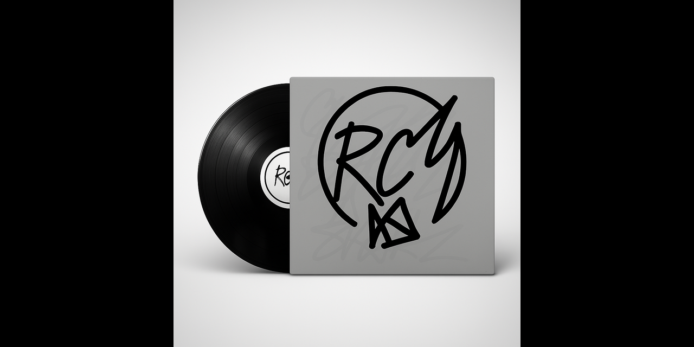
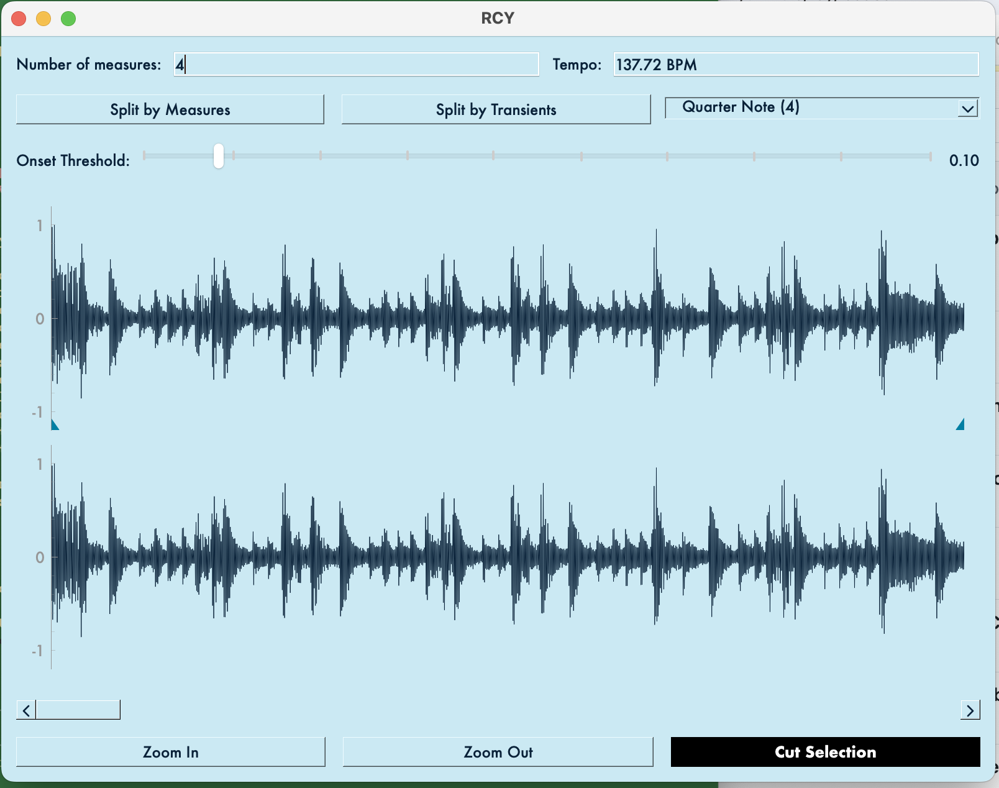

# RCY

**RCY** is a tool designed to process breakbeat loops, enabling users to slice and export them in the **SFZ** format for seamless integration with samplers like the **TAL-Sampler**. Inspired by the aesthetics of New Order's Movement, brutalist design, and hauntological software, RCY combines utility with an appreciation for drum break history.





## Features

- **Breakbeat Slicing**: Automatically detects transients in breakbeat loops and slices them into individual hits
- **Manual Editing**: Precisely place slice points for customized break cutting patterns
- **Selection & Trimming**: Trim audio with start/end markers for perfect loop isolation
- **SFZ Export**: Generate SFZ files with mappings corresponding to the sliced samples for easy import into samplers
- **Historically-Informed Presets**: Access artist-specific slice patterns based on classic jungle and drum & bass techniques
- **Cohesive Design Language**: Distinctive aesthetic based on a consistent color palette and typography

## Design Philosophy

RCY isn't just a tool—it's a perspective on breakbeat culture. The design references hauntological approaches to music technology, with:

- A color palette inspired by New Order's Movement album artwork
- Brutalist interface elements that emphasize function and clarity
- A typography system based on Futura PT Book
- A careful balance between utility and historical resonance

Read our [Breakbeat Science](docs/breakbeat-science.md) guide to understand the three core workflows that shaped jungle, drum & bass, and big beat, and how they're implemented in RCY. For those interested in the history and techniques of sampling in drum & bass, check out our comprehensive [Drum & Bass Sampling Techniques](drum_and_bass_sample_techniques.md) document.

## Requirements

- **Python 3.x**: Ensure Python is installed on your system
- **Dependencies**: Install necessary Python packages using the provided `requirements.txt` file

## Installation

1. **Clone the Repository**:
   ```bash
   git clone https://github.com/tnn1t1s/rcy.git
   cd rcy
   ```

2. **Install Dependencies**:
   ```bash
   pip install -r requirements.txt
   ```

## Usage

1. **Launch the Application**:
   ```bash
   python3 src/python/main.py
   ```

2. **Work with Audio**:
   - The application loads with the Amen break by default
   - Load custom audio with File > Open
   - Set slice points automatically with "Split by Transients" or manually with Alt+Click
   - Adjust the Onset Threshold slider to control automatic transient detection sensitivity
   - Use the measure-based slicing for rhythmically perfect divisions

3. **Selection and Trimming**:
   - Set a start marker with Shift+Click (blue)
   - Set an end marker with Ctrl+Click (blue) 
   - Click the "Cut Selection" button to trim audio to just the selected region

4. **Export Results**:
   - Export your sliced samples and SFZ file using File > Export
   - Choose a destination directory for all exported files

## Historical Presets

The `presets/` directory contains historically-informed breakbeat slice patterns based on specific artists:

- **Amen Break**: Dillinja and LTJ Bukem cutting styles
- **Think Break**: Source Direct and Paradox approaches
- **Apache Break**: Photek-inspired edits

Each preset includes documentation about the artistic context and technical approach. For a deeper understanding of the cultural and technical foundations of these presets, see our [Breakbeat Science](docs/breakbeat-science.md) document. To learn about the technical design of RCY's audio processing, check our [Playback and Export Pipelines](designs/playback-export-pipelines.md) documentation.

## Contributing

Contributions are welcome! Please fork the repository and submit a pull request with your enhancements or bug fixes.

## License

This project is licensed under the [MIT License](LICENSE).